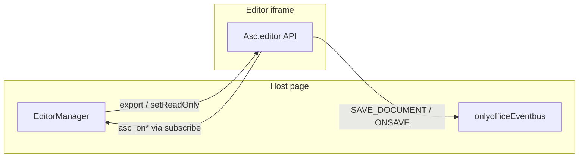

# Comments, Revisions, and Word API

> English | [中文](comments-revisions-word-api.zh.md)

[← Font Configuration](./fonts.md) | [Overview](./overview.md)

`EditorManager` wraps comment and revision capabilities for Word documents, as well as subscriptions to SDK callbacks inside the OnlyOffice iframe. Get the underlying instance via `OnlyOfficeManager.getEditor()`.

## Comments API

```typescript
import { OnlyOfficeManager } from "@/components/onlyoffice-web-comp";
import type {
  CommentInput,
  CommentChangeHandlers,
} from "@/components/onlyoffice-web-comp";

const manager = await OnlyOfficeManager.create({
  fileType: "docx",
  defaultFileName: "New Document.docx",
});
const editor = manager.getEditor();

// List
const comments = await editor.getAllComments();

// Add (accepts a string or a CommentData object)
const id = editor.addComment("请修改此处表述");

// Update / remove / go to
editor.updateComment(id, { Text: "已修改说明" });
editor.removeComment(id);
editor.goToComment(id, { showBalloon: true });

// Listen for comment changes (wrapper around SDK callbacks, async)
const unregister = await editor.registerCommentCallbacks({
  onAdd: (id, data) => {},
  onChange: (id, data) => {},
  onRemove: (id) => {},
});

unregister();
```

### Related Types

- `CommentItem` — `{ Id, Data }`
- `CommentInput` — `CommentData | string`
- `CommentData` — contains `Text`, `UserName`, `Time`, `Replies`, etc.

## Revisions API

```typescript
import type {
  RevisionItem,
  RevisionChangeHandlers,
} from "@/components/onlyoffice-web-comp";

editor.setTrackRevisions(true);
const tracking = editor.isTrackRevisions();
const hasChanges = editor.haveRevisionsChanges();

const revisions: RevisionItem[] = await editor.getAllRevisions();
await editor.addDemoRevision("一段用于生成修订的文本");

editor.goToNextRevision();
editor.goToPrevRevision();
editor.goToRevision(revisions[0].Id);

editor.acceptRevision(revisions[0]);
editor.rejectRevision(revisions[0]);
editor.acceptAllRevisions();
editor.rejectAllRevisions();
editor.acceptRevisionsBySelection(true);
editor.rejectRevisionsBySelection(true);

const unregisterRev = await editor.registerRevisionCallbacks({
  onShowChanges: (items) => {},
  onTrackRevisionsChange: (enabled) => {},
});

unregisterRev();
```

### `RevisionItem`

- `Id` — e.g. `rev-0` or an SDK element id
- `Index` — position in the list
- `Data` — `RevisionData` revision metadata (`TypeName`, `UserName`, `Value`, `DateTime`, etc.)
- `Raw` — the raw SDK object, used for accept/reject/go-to

### `RevisionData`

| Field      | Type     | Description                                 |
| ---------- | -------- | ------------------------------------------- |
| `Type`     | `number` | SDK revision type enum value                |
| `TypeName` | `string` | e.g. `TextAdd`, `TextRem`, `ParaPr`         |
| `UserName` | `string` | Revision author                             |
| `DateTime` | `string` | Revision time (SDK-formatted string)        |
| `Value`    | `string` | Summary of the revision content             |

## `subscribe` — Word SDK Callbacks

Subscribe directly to an `AscWordApiMethod`; underneath it calls `asc_registerCallback` / `asc_unregisterCallback`:

```typescript
import type { AscWordApiMethod } from "@/components/onlyoffice-web-comp";

const unsubscribe = await manager.subscribe({
  type: "asc_onDocumentModifiedChanged" satisfies AscWordApiMethod,
  fn: (modified: unknown) => {
    console.log("文档修改状态:", modified);
  },
});

unsubscribe();
```

### Recommended Callbacks and Business Scenarios

| Callback                        | Scenario                                                                              |
| ------------------------------- | ------------------------------------------------------------------------------------- |
| `asc_onAddComment`              | Sync the sidebar after a comment is added                                             |
| `asc_onChangeCommentData`       | Comment content edited                                                                |
| `asc_onRemoveComment`           | Comment removed                                                                       |
| `asc_onShowRevisionsChange`     | Refresh the revision list                                                             |
| `asc_onDocumentModifiedChanged` | Dirty state, enabling the save button                                                 |
| `asc_onSaveCallback`            | Align with the editor's internal save chain (usually handled inside the component)    |

For the full list of method names, see `type/word-api.ts` (400+ entries, covering advanced capabilities such as content controls, tables of contents, footnotes, and merging).

## Relationship Between the EventBus and SDK Callbacks



- **EventBus**: for cross-module listening at the React layer; suited to `DOCUMENT_READY`, `LOADING_CHANGE`, and saves that carry `binData`.
- **subscribe / register\*Callbacks**: close to the editor's internal state; suited to Word-specific behavior such as comments, revisions, and modification flags.

The two can be used together; remember to clean each of them up on unmount.
